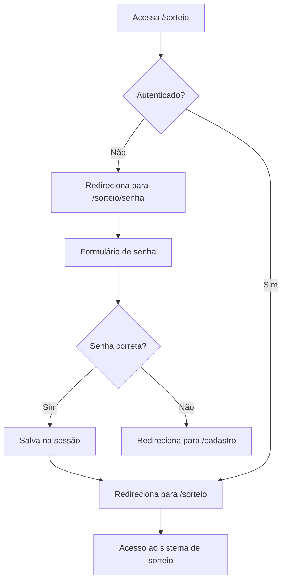

# 04 - Implementação de Autenticação no Sistema de Sorteio

## Contexto

Adicionar proteção por senha ao sistema de sorteio, garantindo que apenas usuários autorizados possam acessar as funcionalidades de sorteio e visualização de resultados.

## Requisitos Implementados

### 1. Autenticação por Senha
- Ao acessar `/sorteio`, senha é solicitada na primeira vez
- Senha armazenada no `.env` como `DRAW_PASSWORD`
- Senha mantida na sessão após validação
- Redirecionamento para tela de cadastro se senha incorreta

### 2. Alterações no Frontend
- Botão "Voltar ao Cadastro" adicionado na tela de sucesso de cadastro
- Remoção do botão "Sortear Novamente" (substituído por "Voltar")

## Arquivos Criados

### Middleware
- `app/Http/Middleware/CheckDrawPassword.php`
  - Verifica se `draw_authenticated` existe na sessão
  - Redireciona para `/sorteio/senha` se não autenticado

### View
- `resources/views/draws/password.blade.php`
  - Formulário de senha com Bootstrap 5
  - Botão para voltar ao cadastro

## Arquivos Modificados

### Configuração
- `.env.example`
  - Adicionada variável `DRAW_PASSWORD="123mudar :)"`

- `config/app.php`
  - Adicionada configuração `draw_password => env('DRAW_PASSWORD')`

### Controller
- `app/Http/Controllers/DrawController.php`
  - `showPasswordForm()`: exibe formulário de senha
  - `verifyPassword()`: valida senha e salva na sessão

### Rotas
- `routes/web.php`
  - Rota `/cadastro` adicionada (alias para `/`)
  - Rotas de autenticação: `/sorteio/senha` (GET e POST)
  - Rotas de sorteio protegidas com middleware `check.draw.password`

### Bootstrap
- `bootstrap/app.php`
  - Middleware `check.draw.password` registrado

### Views
- `resources/views/participants/success.blade.php`
  - Botão "Voltar ao Cadastro" adicionado

- `resources/views/draws/index.blade.php`
  - Botão "Sortear Novamente" substituído por "Voltar"

## Testes

### Novos Testes Adicionados
1. Redirecionar para tela de senha quando não autenticado
2. Exibir formulário de senha
3. Autenticar com senha correta e redirecionar para sorteio
4. Redirecionar para cadastro com senha incorreta
5. Exibir página de sorteio quando autenticado

### Testes Atualizados
Todos os 6 testes existentes de sorteio foram atualizados para incluir:
```php
$this->withSession(['draw_authenticated' => true]);
```

### Cobertura Final
- **22 testes** no total
- **56 assertions**
- 9 testes de cadastro de participantes
- 11 testes de sistema de sorteio (incluindo autenticação)

## Fluxo de Autenticação



## Variáveis de Ambiente

```bash
# Senha para acesso ao sistema de sorteio
DRAW_PASSWORD="123mudar :)"
```

## Commits Realizados

1. **cb21e9e** - Adiciona autenticação por senha no sistema de sorteio
   - Middleware, formulário, rotas e configuração

2. **b2ce71e** - Adiciona testes de autenticação no sistema de sorteio
   - 5 novos testes + 6 testes atualizados

3. **(pendente)** - Atualiza documentação com autenticação de sorteio
   - README.md com seção de segurança e instruções

## Melhorias Futuras Possíveis

- [ ] Implementar múltiplos níveis de acesso
- [ ] Adicionar rate limiting nas tentativas de senha
- [ ] Log de tentativas de acesso ao sorteio
- [ ] Interface para trocar senha sem editar `.env`
